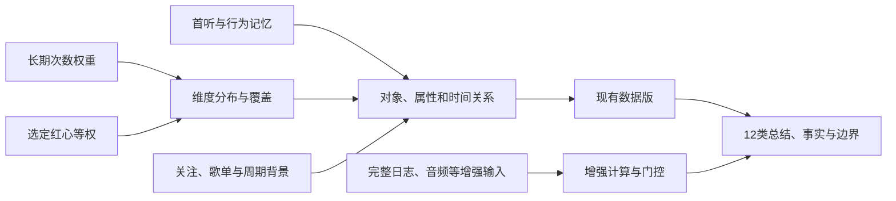

# 审美算法设计与实现：music-aesthetic-2.0

## 目标与完成范围

依据[产品规范](product-spec.md)、[原宣传设想](design/项目宣传点.md)、[数据能力](data-requirements-and-api.md)和[142首真实覆盖](research/song-memory-coverage-2026-09-18.md)。本版实现纯计算引擎、真实资料适配CLI、双版本结果和本机JSON/Markdown报告。后端采集器和微信调用层已切换到本版；旧快照保持只读兼容。纯函数不依赖浏览器、数据库或网络，后端负责组装输入并返回卡片JSON。

产品要回答：长期反复听什么、主动红心选择什么、不同歌手之间有哪些共同审美线索、选择与实播如何联系、这种联系何时发生变化。排行和年度时长作为证据，不作为最终画像。当前数据能解释可见结构和关联，不能证明心理、人格或喜欢的因果原因。

交付共**12类总结，每类现有数据版base和增强版enhanced**。不是给缺失数据编造两个答案：当前版计算能证实的部分，增强版的计算代码已经实现，但输入不满足条件时返回unavailable及所需数据。流行度没有可比参照，因此当前版的正确结果就是“不足以判断小众”，不以年代或冷门歌名替代。旧版六指数只存在于历史快照；新快照兼容字段为空并指向卡片，不再生成或混入审美结果。

## 已获取数据如何使用

| 已验证来源 | 使用方式 | 不作的推断 |
| --- | --- | --- |
| 长期Top100与计数 | 样本实播权重、反复中心、各维度分布 | 不当注册以来全量历史 |
| 选定红心50首、完整当前likelist | 选定歌曲等权；全红心状态单独对照实播 | 不将加入自订歌单或订阅歌单当红心 |
| 周Top100、最近去重300首 | 周相对结构、选定红心是否在最近样本出现 | 最近对象不当事件频率；不把周次数从长期次数相减 |
| 歌曲/专辑/艺人元数据及百科 | 艺人、专辑、曲风、语种、年代、BPM | 推荐标签不当可靠情绪；BPM不当旋律或律动 |
| 首听、累计次数/分钟、红心时间、最多日、常听时段 | 140首关系资料，缺失字段保留未知 | 当前红心时间不是首次红心；常听区间不是完整小时分布 |
| 关注艺人、订阅专辑、三张自有歌单样本 | 与实播/选定红心建立独立关系 | 自订歌单用途不猜，样本不声称全歌单 |
| 平台曲风偏好和相似艺人 | 原始独立参考信号与艺人关系 | 不把未知窗口ratio并入本项目概率，不硬合并不同层级标签 |
| 完成周/月与实时报告、Top20周期排行、年度聚合、总时长 | 保留响应窗口、内容类型、原计数与单位 | Top20不补成Top100，年度playNum不宣称去重；不同窗口不直接比总量 |
| 等级、登录/订阅总计数、公开热门作品和发行资料 | 身份/数据发现/元数据核对背景 | 登录活跃、热歌目录不是用户审美或用户听过的作品 |

单位按字段记录：单曲musicTotalPlayDto.duration和周期分钟；年度playDuration及累计totalDuration按秒。音乐＋播客＋有声书＝全内容汇总，播客不进入音乐权重。发行版本目前可读，但未加入SongFeature，本版不根据版本说明推声音差异；**乐器、制作/影视关联和乐谱亦未形成可靠覆盖，不进入结论**。

## 算法结构



1. **输入与来源**：AestheticInput保留快照采集时间、记忆查询时间和选择规则。CLI从已有导出与加密研究资料读取，不发账号请求、不刷新分析、不改写旧快照。
2. **模块标准化**：长期正计数、去重、排序取100；选定红心去重等权；其他歌曲只作辅助。输入应来自现有normalize，不能把同一歌曲多份原始计数当独立作品。
3. **特征层**：构建维度分布、覆盖率、BPM分位数、集合联系、时间间隔、逐曲关系、周期内容对账。
4. **关系层**：分别比较对象（歌曲/艺人）和审美轴（曲风/语种/年代）；寻找跨艺人的共同曲风。缺少声音特征时不把元数据线索包装成声音测量。
5. **增强层**：输入完整事件、红心历史、已验证音频特征、匹配流行度参照、声明用途的完整歌单或可比多次画像后，运行对应增强算法。
6. **解释层**：每张卡输出purpose、base/enhanced、status、method、coverage、facts、summaries、limitations、requiredData。facts提供可展开证据；provenance标明时间，报告版本与阈值一同固定。

status表示可计算性：覆盖为0时unavailable；低于80%为partial；其他为available。coverage是输入字段覆盖或样本覆盖，**不是正确概率、统计置信区间或人群百分位**。复合卡也保留各维度覆盖，不能用平均值掩盖某维度缺失；强曲风/声音总结另按80%门槛抑制。

源码：[引擎](../packages/algorithms/src/aesthetic/index.ts)、[输入契约](../packages/algorithms/src/aesthetic/types.ts)、[数学层](../packages/algorithms/src/aesthetic/math.ts)、[阈值](../packages/algorithms/src/aesthetic/config.ts)。

## 12类输出与为什么这样设计

| ID与输出 | 当前算法/证据 | 增强算法及额外输入 | 为什么有助于目标 |
| --- | --- | --- | --- |
| center 反复聆听的中心 | 次数概率、Top10份额、ESS、代表作品 | 完整播放事件：实际秒数份额、重听事件率、完成率 | 将“最爱排行”变为重复投入结构；区分少数支点与分散中心 |
| fingerprint 可验证审美坐标 | 艺人/专辑/曲风/语种/年代、BPM分位数、跨艺人共同曲风 | 完整事件：同维度按实际秒数计权 | 从多个表面对象提取共同轴，展示中心和边界，而非只列歌曲 |
| alignment 主动喜欢与实际聆听 | 红心/Top100交集、当前红心实播份额、熟悉艺人的新作品、最近出现 | 完整事件：红心时长份额及完成率 | 显示“主动选择”和“实际投入”的联系；矛盾不归咎用户 |
| continuity 换歌手还是换审美 | 分维度JSD、新艺人份额、共同曲风 | 同体系音频轴：两模块均值差，覆盖各≥80% | 避免把换对象直接说成换审美；找到跨歌手的持续线索 |
| discovery 新发现与旧歌再喜欢 | 首听与当前红心间隔、近30天首听、负间隔异常、实际红心范围 | 完整红心/取消历史：首次喜欢、取消后重新加入次数 | 区别首次遇见与当前主动喜欢，不把重新红心宣传为新发现 |
| lifecycle 一首歌与你的关系 | 双模块140首的相识天数、累计次数/分钟、峰值日、红心时刻 | 完整事件：周序列和活跃周数 | 把多条纪念数据组织为关系卡，增强可核对的个人意义 |
| timeContext 时间背景 | 逐曲常听区间及峰值日；按歌曲统计区间 | 完整事件：北京时间小时实际秒数分布 | 描述何时这些偏好出现，避免从夜间标签推心理或作息 |
| ecology 选择生态 | 关注艺人/订阅专辑的已知实播份额、歌单交集、平台偏好/相似艺人 | 完整歌单＋用户声明用途：各场景与两模块的覆盖 | 比较不同主动选择的层次；场景解释由用户声明支撑 |
| periods 周期投入与内容边界 | 周结构、各报告内容对账、Top20原窗口、年度/总时长背景 | 完整事件：同长度前后半窗秒数及歌曲JSD | 区别“听得多”与“听得不一样”，不让播客或窗口长度干扰音乐画像 |
| popularity 流行度与独立选择 | 无参照则明确不足，不产生小众分数 | 同期同类别歌曲流行度＋≥30首匹配参照：经验百分位 | 让小众判断有比较对象；拒绝把罕见标签当审美优越性 |
| acoustic 声音偏好 | BPM、纯音乐标签；明确不能回答旋律/人声质感/情绪 | 已验证0—1音频轴：旋律、节奏、人声、编曲密度、valence、energy加权均值 | 在可靠特征到位后回答声音共性；现阶段保留问题而非伪答案 |
| trajectory 持续变化 | 单次双模块差异，明确不生成历史趋势 | ≥3次同版本同规则可比画像：相邻/首尾JSD | 从随时查看推进到可复查的变化轨迹；单次选择不称永久转向 |

这些输出形成三条阅读路径：**我的中心与共性**（center/fingerprint/acoustic），**选择与实际投入的关系**（alignment/continuity/discovery/lifecycle/ecology），**它如何随时间出现和变化**（timeContext/periods/trajectory）。popularity仅在可比参照存在时补充，不能抢占核心定位。

它们能推进“歌单反映音乐审美”的原因是把多个独立信号对齐：长期播放代表可见行为，红心代表主动选择，共同属性代表可核对的偏好轴，时间资料描述关系过程。是否让用户感到有用仍需用户核验与产品测试；算法不保证从观察资料恢复喜欢的心理原因。

## 数学定义与双版本细节

### 分布、覆盖与共同点

长期w=playCount，红心w=1；p=w/Σw。输入权重先按最大值缩放，避免大有限数溢出。多艺人/多曲风均分一首歌的p，不能每标签重复拿完整权重。维度coverage=拥有该维度的Σp；已知标签share=标签权重/coverage。缺失维度保持缺失，不放入“其他”后声称已覆盖。

ESS=1/Σp²，Top10=前10份额和。ESS不是注册以来曲库数，只是Top100内的有效均匀播放规模。BPM用有标注作品的加权25/50/75分位数，不用均值掩盖跨度，也不把60/120的节拍折半问题自动修正。

跨艺人共同曲风：取曲风权重≥10%、支持≥3个不同艺人的标签，输出标签、份额、艺人数；这只是共同出现，不能解释为偏好的原因。门槛是保守展示规则，未做人群校准。

JSD=½KL(P||M)+½KL(Q||M)，M=(P+Q)/2，log2，范围0—1。对象集合和标签轴分别算；空分布返回null。JSD=0代表两个可见分布相同，1代表支持完全不相交；没有“显著转向”的统计含义。不同权重/截断/选择规则都可能造成差异，不输出一个混合总距离。

### 当前版与完整事件版

当前版只比较Top100、选定红心和去重最近样本，不能知道完整听完、跳过、日均或每次播放。增强版要求调用者提供complete=true、来源、有效窗口与非负实际秒数、完成状态，歌曲ID必须在元数据集合；任一事件无效则整个事件增强路径不启用。

重听事件率=(事件条数−不同歌曲数)/事件条数；完成率=completed事件/事件条数。实际秒数按歌曲聚合后归一化。事件时段按开始时刻加8小时取北京时间小时，跨小时事件未拆分；不能当精准逐小时总时长。完整窗口内未出现播放的周桶才可记0，缺失资料不能记0。

周期增强按等长度前后半窗分别计实际秒数和作品概率，JSD描述结构，秒数描述投入。两半有空分布时JSD=null，不将“没听”解释为某种曲风转移。

### 发现与关系

daysFromFirstListenToCurrentLike=(当前红心时间−首次可见收听)/86400000；负值保留并计异常。近30天判断使用首听时间，**不是发行时间**。当前版报告较早首听和当前选择，不能判断首次喜欢还是重新点红心。旧输入选择规则/未知时间窗继续保留，补读红心时间不把旧选择改称最近一周。

增强版需要完整历史事件，按歌曲/时间排序：首次like给firstLikeAt；like次数和曾like后经过unlike再like的次数分开。事件完整性是调用者保证的前提，采样观察无法伪装成全历史。关系卡的累计分钟是API原值，不用歌曲长度乘次数替代，也不除以相识天数推日均。

### 缺失声音、场景、流行度和变化数据的算法

- 音频增强：只接受source非空、validated=true、轴值0—1的特征；每个轴独立算覆盖与加权均值。长期或双模块对应轴加权覆盖不到80%不输出强总结。valence/energy是音乐特征，不能推出用户心理。旋律/节奏量表须由供应方先验证同体系可比，不能从BPM或推荐标签生成。
- 场景增强：完整歌单加用户明确声明scene，计算各场景在长期概率和红心等权中的覆盖。场景可重叠，不强制合计100%，不猜“工作/失恋”。
- 流行度增强：matchedReference=true、参照至少30首、均为同口径非负计数；歌曲经验百分位=参照中≤该计数的比例，再按已覆盖长期播放权重归一化。matchedReference需外部审查，本函数不能证明样本匹配；结果不是人群品味百分位。
- 轨迹增强：version一致、不同collectedAt、comparabilityKey一致且分布非空；至少三次才启用。comparabilityKey必须编码采集规则、选择方式、权重和窗口等可比条件，不能仅写账号ID。只输出相邻/首尾距离，方向必须查标签份额，不从距离自动写“变冷/成熟”。

## 解释与质量门控

每类都有计算事实和边界。用户可以沿“文案→卡片facts→来源manifest”核对。无数据、未提供增强输入、低覆盖和真实0分别表示，数值不是可靠性分数。禁止人格、心理、审美优劣和因果断言；用“已知样本中”“主动选择”“共同出现”说明观察范围。

新来源不能回填旧likedAt或改旧createdAt。报告generatedAt是计算时刻，snapshotCollectedAt是老行为快照时间，memoryObservedAt是新查询时间；三者不混同。不同版本结果不相减。扩展算法不产生新数据库分析快照，不触发产品刷新。

## 使用与产物

```powershell
npm run analyze:aesthetic
# 可选增强输入文件：其中字段结构与AestheticInput.enhanced一致
npm run analyze:aesthetic -- .data/real-test .data/real-test/private-enhanced.json
```

输入需要已有exports/latest.json及其快照、对应的complete=true歌曲记忆覆盖资料；不要求现在仍登录。增强输入不自动采集、不生成虚构音频特征。库入口designAesthetic(input)不依赖本机资料，其他账号可使用自己授权的标准化输入。

输出在`.data/real-test/analyses/aesthetic-v2/<计算时间>/`：

- report.json：12类双版本完整事实、覆盖与解释。
- report.md：可直接阅读的画像及增强数据需求。
- input-manifest.json：本机来源路径、查询时间、覆盖和单位。
- analyses/aesthetic-v2/latest.json：最新一次计算目录索引。

结果包含个人偏好和歌曲关系，不提交Git。独立文件不受数据库TTL/账户删除自动清理，用户需管理本机输出。

## 验证标准

测试覆盖：换艺人而曲风相同的反例、多曲风质量守恒、真实0与缺失、未来时间拒绝、完整/不完整事件门控、音频验证标记、重新红心历史、声明场景、流行度参照、版本与规则不一致的轨迹、音乐/播客对账。真实CLI验证12类均有两版、140首记忆正确使用、旧快照未改写、缺失增强输入不激活。

阈值80%、30天、3艺人/10%、至少30个参照和三次画像是未校准规则，后续需要更多账号验证与解释可用性测试；升级须换算法版本并保留旧报告。生产采集/API及微信调用层已接入卡片结构。常规采集只使用provider已经提供的数据，不为启用卡片扩大采集范围，因此首听记忆等研究数据可能显示unavailable；本机CLI可显式读取已授权研究资料生成更完整报告。
