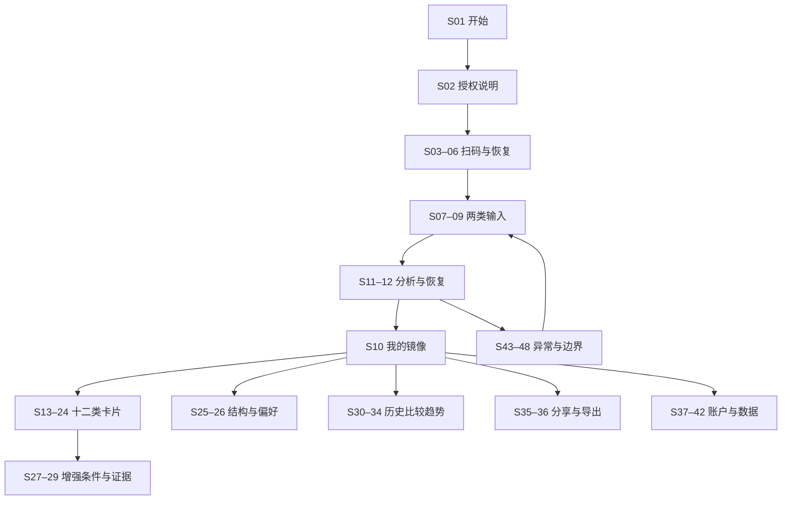

# MusicMirror · 光与回声

这是一套独立于现有前端的 UI 图片与可编辑设计稿。以微信小程序为使用场景，将 ARCAEA 的空灵光感、碎晶和斜向几何，与 Apple 界面强调的层次、留白和可读性结合。没有新增业务页面、联网原型或账号采集。所有画面数字、日期、歌名均为**合成示例**，不能作为用户真实审美结论。

## 打开与交付

- [静态设计总览 index.html](index.html)：直接用浏览器打开；只浏览设计图，不连接服务。
- [视觉概念 PNG](concepts/visual-direction.png)：内置 imagegen 生成的气氛提案。
- [8 组全流程 PNG / SVG 画板](boards/)：每组 6 屏，共 48 个页面与状态。
- [48 个独立 SVG](screens/)：390×844，可在支持 SVG 的设计工具中导入，文字、几何与图表可编辑。不是原生 Figma 文件。
- [流程覆盖矩阵](FLOW-COVERAGE.md)：每一屏的动作、状态及去向。
- [设计变量](tokens.json)、[页面内容数据](screens.json)、[可复现生成源文件](generate-design.mjs)。

生成式概念图只确定材质和构图方向，其中自动生成的附加文案及数字不作为产品规范。例如概念图中的“最近的听歌记录”应以设计稿中的“接口可见长期样本”替代；“风格重合度”不作为算法已有指标。交付的 SVG/PNG 全流程画板、此说明及现行产品契约共同约束最终落地。

## 视觉系统

主题“光与回声”围绕两份输入的相遇展开。长期行为使用紫色，主动红心使用青色，两者交叠形成镜像。碎晶只出现在封面、关系主视觉和装饰背景；按钮与正文使用稳定的圆角表面，不把游戏 HUD 搬到数据阅读区。深色用于精选关系画面和分享预览，其余默认浅色；落地时需支持全局跟随系统，而非强制按页面变色。

390×844 是设计坐标，不是固定设备尺寸。水平边距24、卡片圆角24、按钮高50，顶部为状态栏及微信胶囊保留空间。真实小程序应读取设备安全区与胶囊位置；正文滚动、操作区避让底部手势条，长文与大字号不得截断。SVG外框仅表示画布。导航标记用于跨画板定位，授权与确认流程落地时收起底部主导航，使用返回和取消；四个主导航用于登录后的主页面。

主导航：**镜像**（总览、双输入）／**探索**（12卡、长期结构、主动偏好）／**变化**（历史、比较、趋势）／**我的**（连接、外观、隐私与导出）。首页只挑3条有证据的洞察，不把12类都压缩为评分雷达图。

文字采用中文系统无衬线字体。标题22–25、主要操作16、辅助说明13，画板标记11；正式界面的重要说明至少按系统正文要求放大，支持字体缩放。彩色线始终配文字图例；紫青区分不承担唯一语义。降低透明度时改用实色面板，提高对比度时移除文本后的渐变。动效建议200ms以内，仅做淡入和位置过渡；减少动态效果时停用粒子、视差与旋转。

视觉参考：[ARCAEA 官方展示](https://arcaea.lowiro.com/en/switch)、[Apple Materials](https://developer.apple.com/design/human-interface-guidelines/materials)、[Apple Typography](https://developer.apple.com/design/human-interface-guidelines/typography)。本稿是对这些参考的原创视觉解读，未复制品牌标志、角色立绘或游戏素材。

## 依据与完整流程

优先采用当前 [产品规范](../../product-spec.md)、[API契约](../../api-contract.md)、[小程序调用层](../../miniapp-integration.md)、[隐私规则](../../privacy.md)、[12类算法](../../aesthetic-algorithm-design.md)。原始完成指南的第5、10、13、16、18、25节分别映射到分析、历史、质量、导航、隐私与证据措辞。原始指南的六指数视觉被12类卡片替代；历史旧报告保留历史标记，不换算为新卡片。

| 文档要求 | 画面证据 |
| --- | --- |
| 定位、示例体验与首次授权 | S01–S06；示例模式只在可用环境展示，生产不能依赖关闭的演示登录接口 |
| 二维码 waiting/scanned/expired/authenticated/cancel | S03–S05及矩阵；同机扫码限制 S06 |
| 长期100首与最多50首选定红心 | S07–S09、S25–S26 |
| 未配置、主动清空、状态未验证/已取消红心 | S08、S45；已取消行标记“已取消红心”，保留选择、不自动替换 |
| 刷新、轮询、离开恢复、失败、无变化与限流 | S11–S12、S43、S47 |
| 12类 base/enhanced、覆盖、证据与说明 | S13–S24、S27–S29、S48 |
| 结构、曲风、语种、年代及生态 | S14、S20、S25–S26 |
| 历史不可变、两次比较、三次趋势、不可比 | S30–S34、S46 |
| 传播与分享预览 | S35；来自宣传点和roadmap，是待实现方案 |
| JSON、输入1/输入2 CSV 导出 | S36；来自现有CLI导出能力，是待实现的用户界面 |
| 解绑、删除、退出的不同语义 | S37–S42 |
| 样本不足、元数据缺失、真实零与未知 | S27、S34、S45、S48 |

## 十二类卡片的独立设计

所有卡片都提供“现有数据 / 增强分析”切换。当前版展示已知事实；增强版按该卡的requiredData显示所需资料，不以付费锁或“即将准确”暗示已具备数据。增强可用时沿用该类图形，但更新单位、权重、窗口和证据来源。S27为共享的缺失状态；其列表需要按下表逐卡替换。图形只服务已有事实，不能将装饰环、相交面积或线段长度当精确计量。

| 画面 / cardId | 主要图形与信息 | 增强版条件与呈现 |
| --- | --- | --- |
| S13 center | Top10环与代表作品；ESS在明细解释 | 完整事件→实际秒数份额、重听率、完成率；不同单位分图 |
| S14 fingerprint | 各维度分布，不合成总分 | 完整事件→同维度按实际秒数；各自注明覆盖 |
| S15 alignment | 两输入交集示意，明确15/50分母 | 完整事件→红心时长份额、完成率 |
| S16 continuity | 紫青并列分布，艺人/曲风距离分开 | 双模块已验证声音轴→对应轴均值差与覆盖 |
| S17 discovery | 首听与当前红心两个时点 | 完整红心历史→首次喜欢、取消后重新加入次数 |
| S18 lifecycle | 逐曲关系档案与时间节点 | 完整事件→活跃周、逐周序列；空缺不是零 |
| S19 timeContext | 单曲18–22点区间，注明非频率 | 完整事件→北京时间小时实际秒数，保留起点分桶限制 |
| S20 ecology | 关注、专辑、红心、自有歌单独立节点 | 完整歌单＋声明场景→场景覆盖可重叠，不强制100% |
| S21 periods | 明确音乐、播客、有声书及窗口 | 等长完整事件→投入时长和分布距离分开 |
| S22 popularity | 当前正确呈现为不足以判断 | 同期同类别≥30首参照→经验百分位，不是品味排名 |
| S23 acoustic | BPM分位数与可靠纯音乐标签 | 验证音频轴→每轴均值/覆盖，不能推断用户心理 |
| S24 trajectory | 可比观察节点；不足时不连趋势线 | ≥3个同版本同规则画像→相邻/首尾距离，方向看份额 |

目前常规刷新没有接入所有研究字段；首听、生态、周期等卡片会按实际响应降级。S17–S21展示资料齐备时的设计样例，不意味着生产采集已经支持。全部数字需绑定对应卡片事实后才可在产品中出现。

## 关键交互与文案规范

1. **双输入**：红心不是添加到自订歌单，也不是订阅歌单。选择ID的手工入口保留；自动搜索、候选最近50首、自动红心时间不是现有能力。不能把未知时间范围命名为“最近一周”。
2. **保存与刷新**：保存编辑只改变待分析输入；显示“已保存，刷新后生效”。运行中409保留草稿；重复刷新复用任务；网络超时恢复原run，不创建新任务。任务状态只使用queued/processing/completed/failed/cancelled，不编造端点进度。
3. **分析完成**：打开任务返回的snapshotId；unchanged沿用原报告并保留原采集时间，不把今天刷新时间冒充新数据时间。冷却按服务端结果提示，不固定编造倒计时。
4. **证据**：每个结论关联facts、method、coverage、limitations和provenance。分别显示采集、计算、记忆查询时刻。覆盖是数据充分度，不是正确概率。unknown使用“—＋原因”；真实0显示0；partial列出缺失维度。
5. **历史**：刷新不覆盖旧快照；旧算法与新算法不相减。两次可比报告可比较；三次才描述趋势；相同数据重复刷新不计入观察次数。
6. **分享与导出**：先预览字段，昵称和歌曲名单默认不选；保留范围、日期和必要边界。仅保存用户选择的图片/文件，不自动发送。图片保存失败提示重试，拒绝相册权限不影响查看报告。导出不含Cookie、token、账户ID；本机副本不受服务器删除管理。
7. **账户**：退出只撤销当前会话；解绑停止采集、移除授权与私有缓存，保留报告；删除移除用户关联资料和会话。危险操作先展示影响再确认，错误时不进入成功页。不承诺立即擦除所有历史备份。

## 静态交付与未来实现的界线

PNG与SVG是视觉设计结果，index.html仅作图片索引。二维码不可扫描、按钮无行为、图表不是实时值。wx.login、生产小程序GUI、原生分享、下载接口、音频增强采集、自动红心来源均未在本任务实现。此交付不会修改apps下的任何文件。

PNG画板的来源为确定性SVG渲染；生成式概念图通过内置imagegen生成，提示词见[PROMPTS.md](PROMPTS.md)。SVG可导入设计工具，文本仍依赖本机中文字体；未打包受许可限制的字体。修改screens数据或生成脚本后执行`node docs/ui-design/musicmirror-v1/generate-design.mjs`可重建SVG和静态索引，再按渲染脚本更新PNG。
